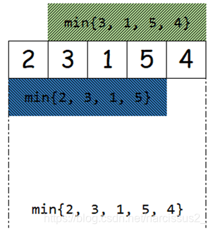

# leetcode-learning-tour

This is a note for my leetcoding learning tour.
I will add some algorithm to this file.

## KMP algorithm (子串搜索算法) 

**思路**： 当一次比对失败时，利用已经匹配的那部分信息，将模式串尽可能多地移动到一个合适的位置，使得下一次比对可以从上一次匹配失败的那个位置开始继续进行。

**Example**:
*s*: "ABCABCABE" *p*: "ABCABE"
- 从零开始查找，到第六位时匹配失败。
- 如果从第五位再开始第二轮查找，则后续字符串长度不够，无法完成查找，得出错误结果。
- 则需要注意前后缀
- 注意到前五个组成的字符串具有相同的前后缀**AB**
- 即求已匹配的部分串中最长的相同前后缀长度为**next**, 第一对不匹配的字符**index**为**i**.
- 下一轮从**i**，开始比对，但将匹配字符串移至**i - next**处。

**Pesudocode**
```latex
\(\text{Naive_Next}(next, P):\)

    \(next[0]\leftarrow-1\)

    \(k\leftarrow-1\)

    \(j\leftarrow0\)

    \(\text{WHILE }j\lt \text{Len}(P) \text{ DO}\)

        \(\text{IF }k=-1\text{ OR }P[j]=P[k] \text{ THEN}\)

            \(k\leftarrow k+1\)

            \(j\leftarrow j+1\)

            \(next[j]\leftarrow k\)

        \(\text{ELSE}\)

            \(k\leftarrow next[k]\)

```

## 单调栈

**例题为 42.接水**

**特点**：栈中的元素始终保持单调有序。通常有两种单调栈，分别是单调递增栈和单调递减栈。

**应用场景**：在数组中寻找元素左侧或右侧的最大或最小值

**框架**
```#java
        deque.push(0);
        for(int i=1;i<lens;i++){
                //循环比较，直到遇到当前元素小于栈顶的元素情况，跳出循环
                //单调递减栈，这里是小于，即nums[i]<nums[deque.peek()]
                //因为while循环里面已经做条件判断了
                while(!deque.isEmpty()&&nums[i]>nums[deque.peek()]){
                    //主要逻辑
                    ............
                    ...........
                    //弹出栈顶元素
                    deque.pop();
                }
                stack.push(i);

        }
```

## 单调队列

**例题为 239.滑动窗口最大值**

**特点**：单调递减或者单调递增的队列。队列中的元素只能在队尾入队、从队首或者队尾出队。

**本质**：单调队列的基本实现就是维护一个双向队列，只有当一个元素是当前最值、或者可能成为最值时才保留，否则出队。

**代码表示**
```cpp
vector<int> v;//依次加入的成员
deque dq;//双向队列、存储下标
int size = v.size();
for( int i = 0;i < size;++i)
{
    while(!dq.empty() && i - dq.front() >= k )
        dq.pop_front();// 超年限的成员、必须让位

    while(!dq.empty() && v[dq.back()] < v[i])
        dq.pop_back();// 老成员能力比新成员小则直接出局

    dq.push_back(i);// 新成员一定入队
}
```

## 滑动窗口

**例题为： 3, 438**

**模板**
```cpp
//外层循环扩展右边界，内层循环扩展左边界
for (int l = 0, r = 0 ; r < n ; r++) {
	//当前考虑的元素
	while (l <= r && check()) {//区间[left,right]不符合题意
        //扩展左边界
    }
    //区间[left,right]符合题意，统计相关信息
}
```

##  Sparse Table(ST/稀疏表) 

**特点** 需要进行预处理，在O(1)时间内处理任意区间内的结果，预处理时间为O(nlogn)

**思路** 将数组或字符串预处理，分成以2为底数的长度的子串，再对子串进行合并，处理，类似于merge sort 但需要进行预处理

**适用性** 适用于RMQ问题和RGQ问题 
- RMQ：Range Minimum Query
- 区间最大最小值问题
- RGQ： Range GCD Query
- 区间最大公约数问题

**Example**
求数组中以**k**为长度的子数组中每个最大的值。

**思路** 对数组长度求以2为底数的对数值，即log<sub>2</sub>(length) = k. 得到数组内最大长度的子数组，可能出现重复问题，但不影响计算结果。如下图所示



**示例代码**
```cpp
#include <bis/stdc++.h>
using namespace std;

const int MAX_H = 100005;
const int LOG = 17;
int a[MAX_N];
int m[MAX_N][LOG];
int bin_log[MAX_H];

int query(int L, int R) {
    int length = R - L + 1;
    int k = bin_log[length]; // something like a matrix
    return min(m[L][k], m[R - (1 << k) + 1][k]);
}

int main() {
    // 1) read input
    int n;
    cin >> n;
    bin_log[1] = 0;
    for (int i = 2; i < n; i++) {
        bin_log[i] = bin_log[i / 2] + 1;
    }

    for (int i = 0; i < n; i++) {
        cin >> a[i];
        m[i][0] = a[i];
    }

    // 2) preprocessijng, O(N*log(N))
    for (int k = 1; k < LOG; k++) {
        for (int i = 0; i + (1 << k) - 1 < n; i++) {
            m[i][k] = min(m[i][k - 1], m[i + (1 << (k - 1))][k - 1]); // find the minimue number in the subarray, each subarray is devided by two
        }
    }

    // 3) answer queries
    int q;
    cin >> q;
    for (int i = 0; i < q; i++) {
        int L, R;
        cin >> L >> R;
        cout << query(L, R) << "\n";
    }
}
```
[详细讲解](https://youtu.be/0jWeUdxrGm4?si=SW8AJGbjruhCvw7c)

## BitWise Operation

the ***&, |, AND ^*** operator

### check if the bit is 1 or 0

```cpp
for (int i = 0; (1 << i) <= n; i++) {
    if (n & (1 << i)) {
        cout << "1";
    } else {
        cout << "0";
    }
}
```

[详细讲解](https://youtu.be/xXKL9YBWgCY?si=nSjfuZOPxzLR9uiY)

## CPP二分查函数

**例题** 240.搜索二维矩阵 II

**lower_bound(begin, end, num)** 从数组的begin位置到end-1位置二分查找第一个大于或等于num的数字，找到返回该数字的地址，不存在则返回end。通过返回的地址减去起始地址begin,得到找到数字在数组中的下标。
**upper_bound(begin, end, num)** 从数组的begin位置到end-1位置二分查找第一个大于num的数字，找到返回该数字的地址，不存在则返回end。通过返回的地址减去起始地址begin,得到找到数字在数组中的下标。

